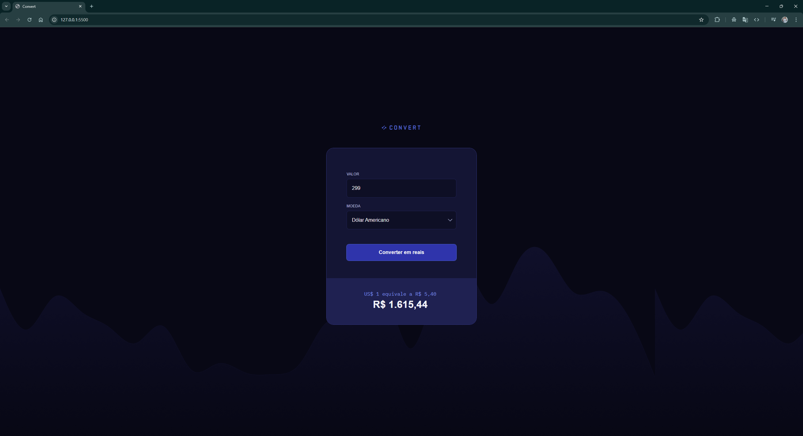

# 💸 Conversor de Moedas em Tempo Real



Este é um projeto de conversor de moedas dinâmico que utiliza a **AwesomeAPI** para obter cotações atualizadas instantaneamente. O objetivo principal foi evoluir de uma lógica de valores fixos para uma aplicação assíncrona que reflete as variações reais do mercado financeiro.

---

## 🚀 Tecnologias Utilizadas

- **JavaScript (ES6+):** Manipulação de DOM, Fetch API e Async/Await.
- **HTML5 & CSS3:** Estrutura e estilização responsiva.
- **AwesomeAPI:** API externa para consumo de dados financeiros em tempo real.

---

## 🧠 Conceitos Aplicados

Durante o desenvolvimento deste projeto, apliquei conceitos fundamentais de engenharia de software que venho aprimorando através de leituras como _Entendendo Algoritmos_ e _Estrutura de Dados com JavaScript_:

1.  **Programação Assíncrona:** Uso de `async/await` para gerenciar requisições HTTP sem bloquear a execução da interface, garantindo uma UX fluida.
2.  **Sanitização de Dados:** Implementação de Expressões Regulares (RegEx) para garantir que apenas números sejam inseridos no input.
3.  **Tratamento de Exceções:** Uso de blocos `try/catch` para lidar com possíveis falhas de conexão ou erros na API, tornando a aplicação mais robusta.
4.  **Internacionalização (i18n):** Utilização do método `toLocaleString` para formatação precisa de moedas seguindo o padrão BRL.

---

## 🛠️ Como Rodar o Projeto

1.  Clone o repositório:
    ```bash
    git clone [https://github.com/matssgit/convert-template.git](https://github.com/matssgit/convert-template.git)
    ```
2.  Acesse a pasta do projeto:
    ```bash
    cd convert-template
    ```
3.  Abra o arquivo `index.html` no seu navegador. Recomendo usar a extensão **Live Server** no VS Code para uma melhor experiência de desenvolvimento.

---

## 📈 Próximos Passos

Este projeto faz parte do meu aprendizado contínuo. Os próximos passos planejados são:

- [ ] Implementar um histórico de conversões usando **Local Storage**.
- [ ] Criar gráficos de variação da moeda nos últimos 7 dias.
- [ ] Refatorar a interface utilizando **React** (aplicando os conceitos do livro _React Fluente_).

---

## 📬 Contato

Desenvolvido por **Matheus Sant'Anna**. Vamos conectar!

- **LinkedIn:** [https://www.linkedin.com/in/matsant](https://www.linkedin.com/in/matsant)
- **GitHub:** [https://github.com/matssgit](https://github.com/matssgit)

---
